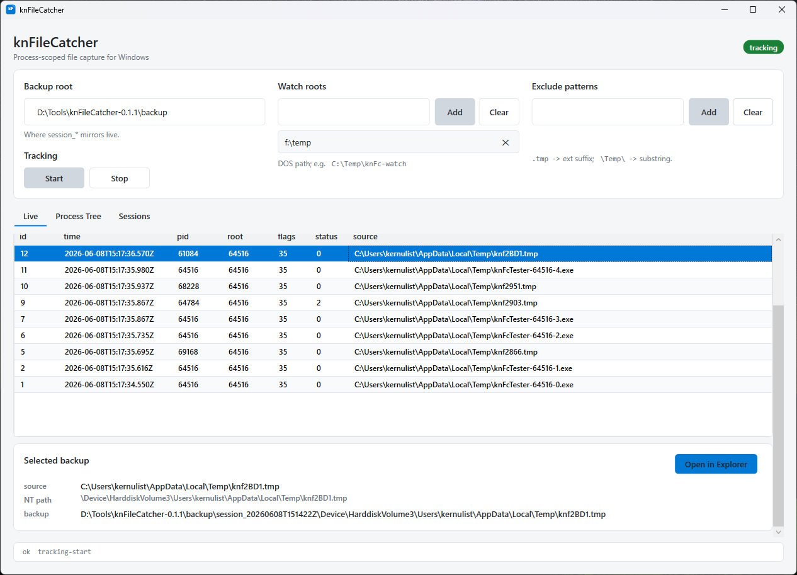
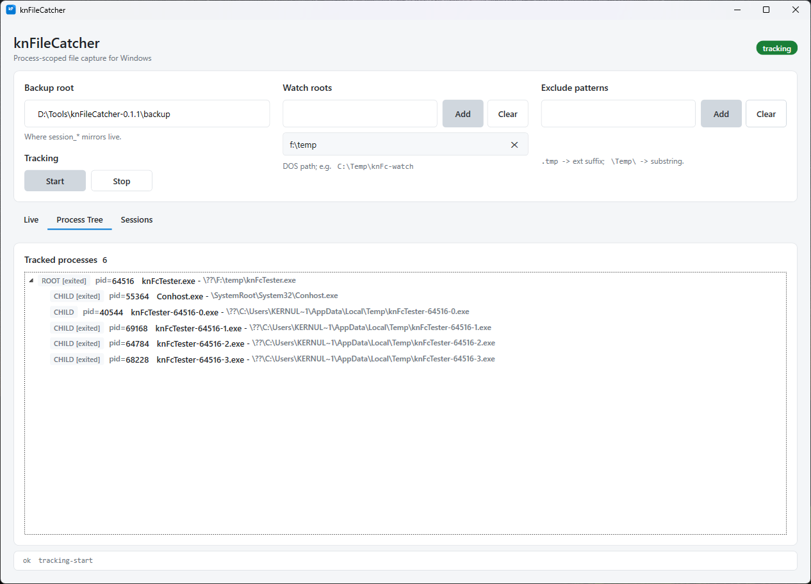

# knFileCatcher

A Windows minifilter-backed file capture tool. Tracks processes that run under
user-specified watch roots **and their descendants (regardless of path)**, and
mirrors every file they create or modify into a separate backup tree -
including files that are deleted before the application terminates.

Internal / development build only - see [Operational scope](#operational-scope).

<p align="center">
  
  
</p>

---

## What it does

Given:

- One or more **watch roots** (DOS paths, e.g. `C:\Games\Foo\`).
- A **backup root** (defaults to `<EXE dir>\backup`, with a `%LOCALAPPDATA%`
  fallback when the EXE folder is read-only).

While tracking is active, knFileCatcher:

1. Marks every process whose image lives under a watch root as a **ROOT**.
2. Marks every descendant of a ROOT as a **CHILD**, regardless of where the
   child's image actually lives. ROOT and CHILD share the same `RootPid`.
3. Whenever a ROOT or CHILD writes to a file (plain `WriteFile`, memory-mapped
   write, `SetEndOfFile`, rename, or a `FILE_CREATE` disposition), the file
   is captured into the backup tree.
   - **Normal close**: enqueued at `PostCleanup`, copied by the user-mode
     worker thread.
   - **`DELETE_ON_CLOSE`**: captured synchronously inside `PreCleanup` so the
     stream is still on disk when the user-mode worker reads it.
   - **Same path captured twice in one session**: previous copy is preserved
     under a `.r<RequestId>` suffix (no silent overwrite).

Every capture appears as one JSON line in the session manifest, and the WPF UX
lets you click a manifest row to open the backup copy in Explorer.

---

## Architecture

```
+-----------------------------+
|  knFcUxWpf.exe  (WPF, x64)  |   requireAdministrator
|                             |
|  - Installs / loads driver  |
|    on startup (SCM + FilterLoad)
|  - Holds FilterPort         |     FilterSendMessage / GetMessage / Reply
|  - 1 C# worker thread       | <--------------------------------+
|    drains FilterGetMessage  |                                  |
|  - Live / Process Tree /    |                                  v
|    Sessions tabs            |                          +---------------+
|  - Unloads + uninstalls     |                          | knFcFlt.sys   |
|    driver on exit           |                          | (minifilter)  |
+-----------------------------+                          +---------------+
```

- **knFcFlt.sys** - the only component touching kernel state. Altitude
  `999999.9` (intentionally outside Microsoft's allocated range, see
  [Operational scope](#operational-scope)).
- **knFcUxWpf.exe** - the single user-facing EXE. WPF, .NET 8,
  self-contained single-file publish (~64 MB). Runs elevated
  (`requireAdministrator` in `app.manifest`). On startup it:
    1. installs the dev cert from the bundled `.sys` into
       `LocalMachine\Root` + `LocalMachine\TrustedPublisher`,
    2. registers `knFcFlt` in the SCM and writes the altitude reg keys,
    3. calls `FilterLoad`,
    4. connects to the FilterPort (`\knFcFltPort`).
  On the first Start it opens `<backupRoot>\session_<UTC>\...`, registers
  self-feedback excludes, then spins up the single C# worker task that drains
  `FilterGetMessage` and copies each `BackupRequest`.
  On window close it does the inverse: stop worker, disconnect,
  `FilterUnload`, `DeleteService`, remove the staged `.sys`, and remove the
  dev cert.

There are no separate service / CLI / console TUI processes in the runtime
package. One driver + one GUI EXE is the shipped surface; `knFcTester.exe`
is a development-only harness.

---

## Repository layout

```
knFileCatcher\
├── README.md          - this file
└── src\
    ├── sign.ps1       - dev cert generator + signtool wrapper
    ├── common\
    │   └── knFcProto.h        - wire protocol shared by driver and user mode
    ├── knFcFlt\               - kernel driver (minifilter)
    │   ├── knFcFlt.inf        - INF (kept for reference; release uses raw SCM register)
    │   ├── knFcFlt.h
    │   ├── knFcFlt.cpp        - DriverEntry, registration, unload
    │   ├── knFcCallbacks.cpp  - Pre/Post Create, Write, SetInfo, Section, Pre/Post Cleanup
    │   ├── knFcContexts.cpp   - StreamHandleContext registration + cleanup
    │   ├── knFcConfig.cpp     - watch-root list with prefix-boundary check
    │   ├── knFcExclude.cpp    - exclude pattern list (extension + substring)
    │   ├── knFcTrack.cpp      - per-PID hash table + Ps notify + snapshot + tree dump
    │   ├── knFcQueue.cpp      - backup queue + 4 worker threads + sync send
    │   ├── knFcComm.cpp       - FilterCommunicationPort + per-message handlers
    │   │                       + deferred system thread that pushes EXIT events
    │   └── knFcUtil.cpp       - PID -> NT image path lookup
    ├── knFcUxWpf\             - the user-mode app (WPF, .NET 8, x64)
    │   ├── knFcUxWpf.csproj
    │   ├── app.manifest       - requireAdministrator, per-monitor DPI
    │   ├── App.xaml(.cs)      - single-instance gate + driver bootstrap/teardown
    │   ├── MainWindow.xaml    - TabControl: Live / Process Tree / Sessions
    │   ├── MainWindow.xaml.cs - global PreviewMouseWheel chain-scroll forwarder
    │   ├── MainViewModel.cs   - state, commands, 1 Hz stats refresh
    │   ├── ProtoStructs.cs    - C# mirror of knFcProto.h
    │   ├── Native.cs          - P/Invoke (fltLib, advapi32 SCM, kernel32)
    │   ├── DriverInstaller.cs - SCM + FilterLoad/Unload + cert install + self-upgrade
    │   ├── DriverClient.cs    - FilterConnect + SendMessage helpers
    │   ├── BackupWorker.cs    - single C# Task draining FilterGetMessage
    │   ├── ManifestWriter.cs  - mutex-guarded manifest.jsonl append
    │   ├── StatsModel.cs      - HistoryEntry record + NtPathMap
    │   ├── ProcessTreeModel.cs- ProcessNode tree
    │   ├── SessionsModel.cs   - <backupRoot>\session_* enumeration
    │   ├── RelayCommand.cs    - minimal ICommand
    │   └── BoolToVisibilityConverter.cs
    ├── knFcTester\
    │   ├── knFcTester.cpp     - tiny C++20 console harness (parent copies self
    │   │                       to %TEMP%, spawns 5 children, each child
    │   │                       creates+writes+deletes one helloworld file)
    │   ├── knFcTester.vcxproj - Visual Studio console project
    │   └── build.ps1          - DevShell + cl wrapper, output to build\tester\
    └── tools\
        ├── build-release.ps1  - one-shot driver + WPF UX -> release zip
        ├── build-driver.ps1   - driver-only fast path
        ├── stress-test.ps1    - multi-process load generator
        └── version.txt        - semver, starts at 0.1.0, bumped by -Release
```

---

## Driver internals

### Per-handle state (StreamHandleContext)

`KNFC_SHC` lives for the lifetime of a `FileObject` (until `IRP_MJ_CLOSE`).

| Field            | Purpose                                                   |
|------------------|-----------------------------------------------------------|
| `OwnerPid`       | Process that opened the handle                            |
| `RootPid`        | Inherited from tracker table at PostCreate                |
| `Flags`          | `KNFC_SHC_*` bits, accumulated atomically                 |
| `NameLock`       | Push lock guarding `CurrentName`                          |
| `OriginalName`   | Captured once at PostCreate, immutable                    |
| `CurrentName`    | Updated on rename (PostSetInformation)                    |

Flag bits (`src\common\knFcProto.h`):

| Bit                          | When set                                              |
|------------------------------|-------------------------------------------------------|
| `WRITE_INTENT`     `0x01`    | Open requested any write access OR a creating dispo OR `DELETE_ON_CLOSE` |
| `MODIFIED`         `0x02`    | PostWrite / EOF-class SetInfo / section sync / created / delete-only |
| `DELETE_ON_CLOSE`  `0x04`    | Open / SetInfo asked for delete-on-close              |
| `RENAMED`          `0x08`    | PostSetInformation observed a rename                  |
| `TEMPORARY`        `0x10`    | (reserved)                                            |
| `CREATED`          `0x20`    | CREATE / SUPERSEDE / OVERWRITE[_IF] (also sets MODIFIED) |
| `BACKED_UP`        `0x40`    | PreCleanup already handled (DELETE_ON_CLOSE)          |

Note that `DELETE_ON_CLOSE` always implies `MODIFIED` since M8 - so even a
delete-only open (no `WriteFile` between create and close, e.g. `ZwDeleteFile`)
gets a sync capture of the file's pre-delete content.

### Callback wiring

| IRP_MJ_*                              | Pre                         | Post                        |
|---------------------------------------|-----------------------------|-----------------------------|
| `CREATE`                              | early skip for kernel mode  | classify intent, install SHC |
| `WRITE`                               | -                           | OR `MODIFIED`               |
| `SET_INFORMATION`                     | -                           | EOF/Alloc -> MODIFIED, rename -> capture new name, dispo -> DELETE_ON_CLOSE |
| `CLEANUP`                             | DELETE_ON_CLOSE -> sync send (sets BACKED_UP) | enqueue async (skipped if BACKED_UP) |
| `ACQUIRE_FOR_SECTION_SYNCHRONIZATION` | writable section -> MODIFIED | -                          |

### Backup queue (kernel side)

| Setting                          | Value         | Notes                                      |
|----------------------------------|---------------|--------------------------------------------|
| `KNFC_QUEUE_WORKER_COUNT`        | 4             | Kernel system threads draining the queue   |
| `KNFC_QUEUE_MAX_DEPTH`           | 16 384        | Cap before items are dropped + counted     |
| Async send reply timeout         | 10 s          | Constant per item                          |
| **Sync (PreCleanup) timeout**    | 10 s + 1 s per 50 MB of `FileSizeHint`, capped at 60 s | Multi-GB DELETE_ON_CLOSE files |
| Fallback                         | sync fail -> async enqueue | At least one more chance per request, status surfaces in manifest |

The single linked list is guarded by a spin lock. Producers (`knFcQueueEnqueue`)
do an `InterlockedIncrement` to check the depth before allocating, so the cap
is lock-free.

### Kernel pool allocation compatibility

All driver heap allocations go through `knFcAllocateNonPaged`. At driver load
it resolves `ExAllocatePool2` with `MmGetSystemRoutineAddress`; Windows builds
that export it use `POOL_FLAG_NON_PAGED | POOL_FLAG_UNINITIALIZED`, while older
Windows 10 builds fall back to `ExAllocatePoolWithTag(NonPagedPoolNx, ...)`.
This avoids a hard import that would prevent the driver from loading on systems
without `ExAllocatePool2`, while keeping the old uninitialized-allocation
semantics because the driver already zeroes the structures it needs to zero.

### Process tracker

256-bucket hash table keyed by PID, guarded by an `EX_PUSH_LOCK`. Populated
two ways:

- `PsSetCreateProcessNotifyRoutineEx` for new processes (creation classified
  in `knFcClassifyAndInsert`).
- A boot-time snapshot via `ZwQuerySystemInformation(SystemProcessInformation)`
  and `ZwQueryInformationProcess(ProcessImageFileName)`, run two passes
  (image-prefix roots, then iterative children-by-parent until stable).

Snapshot orphans (parent already exited) cannot be classified as CHILD and
are left untracked.

### Process CREATE / EXIT push notifications

`KnFcMsgProcessEvent = 102` is pushed from the kernel to the WPF client
whenever a tracked process is created or exits. CREATE is pushed inline from
the Ps notify callback. EXIT is queued onto a **dedicated kernel system
thread** for deferred delivery because direct `FltSendMessage` from the
in-context exit callback returns `STATUS_THREAD_IS_TERMINATING` (the calling
thread is mid-termination).

The push carries `KNFC_PROCESS_EVENT` (header + `EventType` + `KNFC_PROC`) and
**requires** a `KNFC_PROCESS_EVENT_REPLY`. A true no-reply `FltSendMessage`
leaks the message slot back into the user queue and the client receives the
same event forever; the reply (any `Status`) frees the slot.

### Watch-root matching

Prefix-match with **boundary enforcement**. A root of `\Foo` matches `\Foo`,
`\Foo\bar.txt`, but **not** `\Foobar.txt`. The boundary character is `\` -
either the root itself ends with one, or the next character in the candidate
path is `\`, or the candidate is exactly equal to the root.

### Exclude patterns

Pattern strings (max 64 entries, 128 chars each):

- Pattern beginning with `.` -> case-insensitive **suffix** match
  (e.g. `.tmp` matches anything ending in `.tmp`).
- Otherwise -> case-insensitive **substring** match against the final NT path
  (e.g. `\Temp\` matches anything traversing a `Temp` dir).

Matched paths are skipped before any enqueue or sync send. The match counter
is reported in `KNFC_STATS::ExcludeMatched`.

**Self-feedback guards.** Before any worker starts, the WPF bootstrap pushes
two excludes into the kernel:

1. the literal substring `\manifest.jsonl`,
2. the NT-path tail of the active `BackupRoot`.

This prevents the act of writing a backup (and the manifest line that
describes it) from being re-captured by the driver and re-enqueued as a new
backup, which would otherwise drive an infinite write loop.

The Excludes list in the UI is the user-managed list only. Driver
`ExcludeCount` also includes these internal guards. If the user clears or
removes excludes after a session is open, the UI re-registers the internal
guards before normal operation continues.

---

## Short-lived file lifecycle (capture guarantees)

This section enumerates how knFileCatcher handles files that exist briefly
and disappear. All scenarios assume the owning process is tracked.

| Scenario                                              | Outcome                                                    |
|-------------------------------------------------------|------------------------------------------------------------|
| `CreateFile(CREATE) + CloseHandle` (0-byte create)    | OK - PostCreate sets `MODIFIED` + `CREATED`, async enqueue |
| `CreateFile(DELETE_ON_CLOSE) + WriteFile + Close`     | OK - PreCleanup sync send, `BACKED_UP` set                 |
| `WriteFile + SetFileInfo(Delete=TRUE) + Close`        | OK - same path as above                                    |
| Create-time `FILE_DELETE_ON_CLOSE` delete-only open   | OK since M8 - create options mark `DELETE_ON_CLOSE` + `MODIFIED` |
| Disposition-only delete on an otherwise unmodified handle | No extra row by design; it only marks `DELETE_ON_CLOSE` unless the handle was already modified |
| Memory-mapped write only (`MapViewOfFile` + memcpy)   | OK - section sync callback flips `MODIFIED`                |
| Atomic write (`tmp` + WriteFile + Rename + Close)     | OK - rename captures new name; backup written to final path |
| Same path created, deleted, recreated within session  | OK - second backup uses `.r<RequestId>` suffix (no overwrite) |
| Multi-GB DELETE_ON_CLOSE                              | OK if user-mode worker can drain inside dynamic timeout (10 s + size-based extra) |
| Sync send fails (timeout / port error)                | Best-effort fallback to async enqueue; failure visible in manifest |
| Burst: 16 K+ files in seconds                         | First 16 384 queued items are accepted; new overflow items are dropped and counted as `QueueDropped` |
| ADS (`foo.txt:stream2`)                               | OK - `:` escaped to `$` in backup destination               |
| Two handles, one closes early                         | Only the closing handle's SHC is processed; file stays alive for the other handle |
| Child of ROOT creates a file outside the watch root   | OK - lineage tracking applies; backup written normally     |
| Same `BackupRequest` redelivered by fltmgr            | Worker dedup: 4096-entry LRU on `msgId`, duplicates dropped silently |

### Race window during DELETE_ON_CLOSE

```
T0  app    : CloseHandle(h)
T1  FltMgr : our PreCleanup (we are altitude 999999.9 = first)
T2  driver : SHC.Flags has MODIFIED+DELETE_ON_CLOSE
                -> knFcCommSendMessage with dynamic timeout
T3  WPF    : FilterGetMessage returns; DoBackup starts
T4  WPF    : CreateFileW(\\?\GLOBALROOT.., SHARE_RWD)
                file is still on disk + FCB still valid -> open succeeds
T5  WPF    : read + write + close; FilterReplyMessage
T6  driver : sync send returns -> set BACKED_UP -> PreCleanup returns
T7  FltMgr : lower minifilters' PreCleanup; file system cleanup
T8  FltMgr : Close -> disk deletion
```

The window between T2 and T7 is where capture happens. Because our altitude
puts our PreCleanup first in the cleanup chain, the file system has not yet
begun its cleanup processing when the user-mode worker opens the file.

---

## On-disk artifacts under BackupRoot

Files live under the configured `BackupRoot`:

| Path                                              | Producer  | Consumer  | Format            |
|---------------------------------------------------|-----------|-----------|-------------------|
| `<root>\session_<UTC>\manifest.jsonl`             | knFcUxWpf | knFcUxWpf | JSON line/event   |
| `<root>\session_<UTC>\<NT-mirror>\<original>`     | knFcUxWpf | end user  | raw copy of the captured file (or with `.r<id>` suffix on dest collision) |

Driver counters and the process tree are now in-memory only: the WPF UX
pulls them on demand via `KnFcMsgGetStats` / `KnFcMsgGetProcessTree` rather
than writing `stats.json` / `process-tree.json` files. The legacy console
viewers that consumed those files are no longer built.

**manifest.jsonl** - one JSON object per line (newest line == newest event):

```json
{"id":42,"ts":"2026-06-08T00:15:29.103Z","pid":1234,"root_pid":1234,
 "flags":3,"size_hint":2048,
 "src":"\\Device\\HarddiskVolume3\\Temp\\knFc-watch\\hello.txt",
 "dest":"D:\\knFcBackup\\session_20260608T001500Z\\Device\\HarddiskVolume3\\Temp\\knFc-watch\\hello.txt",
 "status":0}
```

---

## IPC protocol (legacy knFcSvc <-> knFcUx pipe) - historical reference

> Since **M10** the single `knFcUxWpf.exe` talks to the driver directly
> over the FilterPort (`\knFcFltPort`). There is no longer any
> user-mode service and no JSON-over-named-pipe IPC. The section below
> is kept only for readers of the pre-M10 architecture; the legacy
> binaries are no longer built or shipped.

Pipe: `\\.\pipe\knFcSvc-cmd`, message-mode, ACL = SYSTEM/Admins/Interactive
(SDDL: `D:(A;;FA;;;SY)(A;;FA;;;BA)(A;;GRGW;;;IU)`).

Request: one UTF-8 JSON line.
Reply:   one UTF-8 JSON line.

| `op`                | `arg`            | What the service did                                |
|---------------------|------------------|-----------------------------------------------------|
| `ping`              | -                | returns `{"ok":true}`                               |
| `tracking-start`    | -                | sends `KnFcMsgStart` to driver                      |
| `tracking-stop`     | -                | sends `KnFcMsgStop`                                 |
| `add-watch-root`    | DOS path string  | resolves to NT path, sends `KnFcMsgAddWatchRoot`    |
| `clear-watch-roots` | -                | sends `KnFcMsgClearWatchRoots`                      |
| `add-exclude`       | pattern string   | sends `KnFcMsgAddExclude`                           |
| `clear-excludes`    | -                | sends `KnFcMsgClearExcludes`                        |

Reply schema: `{"ok":true}` or `{"ok":false,"rc":<int>,"err":"<msg>"}`.

---

## Wire protocol (driver <-> knFcUxWpf)

Defined in `src\common\knFcProto.h`. Current version: `0x00070000` (M7).
FilterPort: `\knFcFltPort`, `MaxConnections = 1` - only the active
`knFcUxWpf.exe` may connect.

All `KNFC_*` request/reply bodies are preceded by `KNFC_MSG_HEADER`
(`Type:u32`, `Size:u32`). When sent through fltmgr the buffer also carries
`FILTER_MESSAGE_HEADER` (kernel -> user) or `FILTER_REPLY_HEADER` (user ->
kernel). Both fltmgr headers are **16 bytes each** (the SDK defines them
without `#pragma pack(1)`). The KNFC payload bodies themselves are
`#pragma pack(1)`.

| Message                       | Direction        | Payload                                          |
|-------------------------------|------------------|--------------------------------------------------|
| `Ping = 1`                    | client -> kernel | header / `KNFC_PING_REPLY`                       |
| `ClearWatchRoots = 5`         | client -> kernel | header only                                      |
| `AddWatchRoot = 6`            | client -> kernel | `KNFC_ADD_WATCH_ROOT_REQ`                        |
| `Start = 7`                   | client -> kernel | header only                                      |
| `Stop = 8`                    | client -> kernel | header only                                      |
| `ClearExcludes = 9`           | client -> kernel | header only                                      |
| `AddExclude = 10`             | client -> kernel | `KNFC_ADD_EXCLUDE_REQ`                           |
| `GetStats = 11`               | client -> kernel | header / `KNFC_STATS_REPLY` (`KNFC_STATS`)       |
| `GetProcessTree = 12`         | client -> kernel | header / `KNFC_PROCESS_TREE_REPLY` (up to 128 `KNFC_PROC`) |
| `BackupRequest = 100`         | kernel -> client | `KNFC_BACKUP_REQUEST` / `KNFC_BACKUP_REPLY`      |
| `ProcessEvent = 102`          | kernel -> client | `KNFC_PROCESS_EVENT` / `KNFC_PROCESS_EVENT_REPLY` (CREATE inline, EXIT via deferred system thread) |

---

## Build & install

The active build flow supports both Visual Studio IDE builds and script-driven
headless builds. The driver and tester are C++20 (`.cpp`), and the WPF UX is
.NET 8 x64.

### A. Visual Studio solution

```powershell
.\knFileCatcher.sln
```

Open the solution in Visual Studio 2022 with the WDK installed, select
`Release|x64`, and build. The solution contains:

| Project       | Output        | Notes                                  |
|---------------|---------------|----------------------------------------|
| `knFcFlt`     | `knFcFlt.sys` | WDK minifilter project, C++20, x64     |
| `knFcUxWpf`   | `knFcUxWpf.exe` | WPF user-mode app, .NET 8, x64       |
| `knFcTester`  | `knFcTester.exe` | Native console harness, C++20, x64  |

The driver project writes outputs under `build\ide\...` and runs `src\sign.ps1`
as a post-build signing step.

### B. Driver-only direct build

```powershell
.\src\tools\build-driver.ps1
# -> compiles 9 C++20 TUs with `cl /kernel /std:c++20`,
#    links with `link /DRIVER`,
#    signs with sign.ps1. Produces knFcFlt.sys (~35 KB).
```

`build-driver.ps1` enters a VS dev shell via `Microsoft.VisualStudio.DevShell.dll`
so `vcvars64.bat` is not required separately. Useful for headless builds.

### C. Full release package (recommended)

```powershell
.\src\tools\build-release.ps1
# -> builds driver (knFcFlt.sys) + single WPF UX (knFcUxWpf.exe),
#    emits .\release\knFileCatcher-<version>\ and .zip.
#    Does NOT modify version.txt.
#
# .\src\tools\build-release.ps1 -Release
# -> same, plus bumps the patch in src\tools\version.txt after success.
#
# .\src\tools\build-release.ps1 -Version v.0.2.0
# -> builds at the given version without touching version.txt.
```

`version.txt` starts at `0.1.0`. Only the `-Release` flag bumps the patch;
plain `build-release.ps1` and `-Version` builds leave it alone.

The produced zip is self-contained for lab deployment. See
[Build scripts](#build-scripts) below for all options, and the next
section for the per-machine install steps.

### On the test machine

One-time prep (just one line):

```powershell
bcdedit /set testsigning on
# reboot
```

That's it. **No PFX import needed.** On startup `knFcUxWpf.exe` extracts
the signing cert directly out of the bundled `.sys` and registers it in
`LocalMachine\Root` + `LocalMachine\TrustedPublisher`; on shutdown it
removes the cert as well. (`Import-PfxCertificate` is no longer part of
the install flow.)

Per-session usage:

```text
1. Unzip the release anywhere.
2. Double-click knFcUxWpf.exe. UAC will prompt for elevation - accept.
3. In the GUI, set the backup root and add a watch root, then Start.
4. Close the window when done; the driver and cert are fully torn down.
```

The backup root is editable until the first Start. At Start, the app opens a
new `session_<UTC>` directory, registers the self-feedback excludes, starts
the single FilterPort reader task, and then asks the driver to begin tracking.
After that the field is locked for the lifetime of the app session.

What the GUI does on startup:
- extracts the signing cert from `knFcFlt.sys` and adds it to the two
  stores above
- copies `knFcFlt.sys` into `%SystemRoot%\System32\drivers\`. If a
  previously installed `knFcFlt` service is found, `EnsureInstalled`
  hashes both the source and the staged copy; on mismatch it unloads
  the live driver and reinstalls the new one automatically (self-upgrade)
- registers the service with altitude `999999.9`
- calls `FilterLoad`
- connects to the FilterPort

On exit it reverses the whole sequence. The system is left as it was.

---

## Build scripts

All scripts live under `src\tools\` and assume Visual Studio 2022 +
WDK + (optionally) .NET 8 SDK on the build machine. They auto-detect
their tools, so a separate `vcvars64.bat` call is not required.

### `build-release.ps1` - full package

Builds the driver + the single self-contained WPF EXE and packages
them as `release\knFileCatcher-<version>.zip`. Reads the version from
`src\tools\version.txt`; the `-Release` flag bumps the patch after a
successful build, `-Version` overrides without bumping.

| Flag              | Effect                                                              |
|-------------------|---------------------------------------------------------------------|
| `-Release`        | Bump `version.txt` patch after a successful build                   |
| `-Version <str>`  | Build at the given version; does NOT touch `version.txt`            |
| `-OutDir <path>`  | Zip destination (default: `<repo>\release`)                         |
| `-NoSign`         | Skip the driver signing step (still produces an unsigned `.sys`)    |

Self-containment is wired into `knFcUxWpf.csproj`
(`PublishSingleFile=true`, `SelfContained=true`,
`EnableCompressionInSingleFile=true`, `DebugType=embedded`), so the
publish always emits one `.exe` with the .NET 8 runtime + PDB folded
inside.

Examples:

```powershell
.\src\tools\build-release.ps1                 # plain build, no version bump
.\src\tools\build-release.ps1 -Release        # build + bump patch
.\src\tools\build-release.ps1 -Version v.0.2.0  # build at explicit version
```

Resulting layout (single flat folder, no subdirectories):

```
knFileCatcher-<version>\
    knFcFlt.sys                       signed driver (~35 KB)
    knFcFlt.pdb
    knFcUxWpf.exe                     self-contained single-file EXE (~64 MB)
```

The target machine needs no .NET installed - just unzip and double-click.

### `build-driver.ps1` - driver-only

Compiles the C++20 driver TUs, links, and signs `knFcFlt.sys` without
going through the Visual Studio project. Useful for fast iteration on the
kernel side, or on a build agent where the VS WDK extension is not installed.

| Flag                  | Effect                                                          |
|-----------------------|-----------------------------------------------------------------|
| `-OutDir <path>`      | Output directory (default: `<scriptdir>\build`)                 |
| `-NoSign`             | Skip the `sign.ps1` call                                        |
| `-VsPath <path>`      | VS install root override (auto-detected by default)             |
| `-SrcDir`, `-CommonDir` | Source / common header dir override (rarely needed)           |

Examples:

```powershell
.\src\tools\build-driver.ps1
.\src\tools\build-driver.ps1 -OutDir E:\tmp\knFcFlt-build -NoSign
```

### `sign.ps1` - self-signed dev certificate

Creates the `CN=knFcFlt-Dev` self-signed cert on first run (in
`Cert:\CurrentUser\My`) and signs the given `.sys` / `.cat`. Already
invoked automatically by `build-driver.ps1`, `build-release.ps1`, and the
`knFcFlt.vcxproj` IDE post-build step, so direct use is rarely needed.

| Param        | Required | Notes                                                |
|--------------|----------|------------------------------------------------------|
| `-Sys`       | yes      | Path to the `.sys` to sign                           |
| `-Cat`       | no       | Path to the `.cat` if Inf2Cat was run                |
| `-Subject`   | no       | Override cert subject (default `CN=knFcFlt-Dev`)     |

PFX export is no longer needed: at run time `knFcUxWpf` reads the
Authenticode cert directly out of the signed `.sys` and stages it into
the machine cert stores, so the lab box only needs `bcdedit /set
testsigning on`.

### `stress-test.ps1` - load generator

Spawns N parallel "runner" processes (staged under the watch root) that:

- create plain files inside the watch root
- write to files outside the watch root (lineage exercise)
- rename half the files
- memory-map and modify one file
- open and close a `DELETE_ON_CLOSE` temp file

| Flag                | Default | Effect                                                |
|---------------------|---------|-------------------------------------------------------|
| `-WatchRoot`        | (req)   | DOS path that knFcUxWpf is monitoring                 |
| `-OutsideRoot`      | (req)   | DOS path outside the watch root                       |
| `-Processes`        | 4       | Parallel root processes                               |
| `-FilesPerProcess`  | 200     | Plain files per process inside the watch root         |

Example:

```powershell
.\src\tools\stress-test.ps1 `
    -WatchRoot   C:\Temp\knFc-watch `
    -OutsideRoot C:\Temp\knFc-out `
    -Processes 8 -FilesPerProcess 500
```

After it completes, verify via `GetStats` that `queue.dropped == 0`
(or very low) and the session's `manifest.jsonl` has roughly
`Processes * FilesPerProcess * 1.6` lines.

### `knFcTester.exe` - deterministic 5-burst harness

A small native C++20 console used for quick capture-path sanity checks. It
exercises both the **process tracking** code (ROOT/CHILD attribution
across self-copy + spawn) and the **backup pipeline** (PostCleanup
enqueue path, plus the implicit empty-file create that
`GetTempFileNameW` performs).

Build:

```powershell
.\src\knFcTester\build.ps1
# -> build\tester\knFcTester.exe (~148 KB, console, x64)
```

Behavior:

- **Parent** (no arg): copies itself five times into `%TEMP%` as
  `knFcTester-<pid>-<i>.exe`, spawns each copy with the `--child`
  argument, waits for all of them to finish, then deletes the copies.
- **Child** (`--child`): calls `GetTempFileNameW` to get a random
  `%TEMP%\knf????.tmp`, writes the bytes `helloworld` into it, and
  deletes the file. Exits.

Expected backup count depends on whether the parent is tracked:

| Watch root setup                                  | Parent backups | Child backups        | Total |
|---------------------------------------------------|----------------|----------------------|-------|
| Parent EXE folder is a watch root (parent = ROOT) | 5 (CopyFile)   | 5 children x 2 each  | **15** |
| `%TEMP%` is the watch root (parent untracked)     | 0              | 5 children x 2 each  | **10** |

The "x 2 per child" comes from the two real captures driver-side: the
0-byte file `GetTempFileNameW` creates, and the same file reopened
`CREATE_ALWAYS` + written with `helloworld`. `DeleteFileW` does NOT
add a third backup because its disposition-only path sets
`SHC_DELETE_ON_CLOSE` only - it does not stamp `SHC_MODIFIED` unless
the handle had already been modified, so the PreCleanup sync-send and
the PostCleanup async enqueue both skip that handle.

Two manifest rows per child share the same source path; the second
one lands at `<dest>.r<RequestId>` due to the dest-collision suffix
rule (so the 0-byte and the 10-byte capture coexist in the backup
tree).

---

## User interface

The WPF window has three tabs:

- **Live** - real-time backup feed plus collapsible **Driver** and
  **Session** cards (both `Expander`, `IsExpanded = False` by default to
  keep the feed dense). The driver card shows `KNFC_STATS` counters
  refreshed at 1 Hz; the session card shows session-local backup
  counts and the active manifest path.
- **Process Tree** - rooted view of the kernel's per-PID table. ROOTs at
  the top, CHILDren grouped under their `RootPid`. Refreshed via
  `KnFcMsgGetProcessTree`, augmented in real time by the
  `KnFcMsgProcessEvent` push stream.
- **Sessions** - enumeration of `<BackupRoot>\session_*` directories, with
  per-session manifest preview and Explorer launch.

A global `PreviewMouseWheel` handler walks visual ancestors from the
mouse-over element up to the window and forwards the wheel event to the
nearest scrollable `ScrollViewer`, so scrolling inside an inner panel
chain-scrolls the outer view once the inner one hits its limit.

---

## Operational scope

- **Internal / development tool**. Not intended for external distribution.
- The minifilter uses altitude `999999.9`, which is **outside** Microsoft's
  allocated `FSFilter Activity Monitor` range. Loading therefore requires
  testsigning to be enabled. Re-allocation would be needed before any
  external shipping.
- Test signing only: a self-signed dev cert created by `sign.ps1`. No EV /
  WHQL flow.
- Single-instance enforcement:
  - knFcUxWpf:  `Global\knFcUx_SingleInstance` mutex (user mode)
  - Driver:     FilterPort `MaxConnections = 1` (only one `knFcUxWpf`
                may attach at a time)

---

## Glossary

| Term            | Meaning                                                                  |
|-----------------|--------------------------------------------------------------------------|
| Watch root      | A user-chosen filesystem path; processes whose image lives under one of these are tracked as ROOTs |
| ROOT            | A process classified as a tracking root because its image is in a watch root |
| CHILD           | A descendant of a ROOT in the process tree; tracked regardless of where its image lives. Shares `RootPid` with its ROOT |
| SHC             | `StreamHandleContext` - per-`FileObject` state attached by the driver    |
| Backup root     | The configured destination directory; defaults to `<EXE dir>\backup`, falls back to `%LOCALAPPDATA%\knFileCatcher\backup` |
| Session         | One run of knFcUxWpf; identified by `session_<UTC timestamp>` under the backup root |
| Manifest        | `session_*\manifest.jsonl`; one JSON line per file capture event         |
| Sync send       | `PreCleanup` path used for `DELETE_ON_CLOSE`; blocks the caller until knFcUxWpf replies |
| Async enqueue   | Normal path; producers push to a kernel queue drained by 4 system threads, then forwarded to the single user-mode worker thread |

---

## Status by milestone

| Milestone | Scope                                                                                                            |
|-----------|------------------------------------------------------------------------------------------------------------------|
| M1        | Driver skeleton, FilterPort, PreCreate logging                                                                   |
| M2        | Process lineage tracking + snapshot of pre-existing processes                                                    |
| M3        | StreamHandleContext, PostCleanup async enqueue, user-mode worker pool with copy mirror                           |
| M4        | Section-mapped writes, rename precision, manifest.jsonl, long-path destinations, disk-full policy                |
| M5        | Creation-implies-modified, DELETE_ON_CLOSE sync send (initially PostCleanup), exclude patterns, GetStats, console TUI |
| M6        | Driver worker pool x4, Named Pipe IPC server, WPF UX (Live tab), stress-test                                     |
| M7        | DELETE_ON_CLOSE moved to PreCleanup, GetProcessTree API, WPF UX TabControl (Live / Process Tree / Sessions)      |
| M8        | Code-review fixes + short-lived-file hardening: prefix-match boundary, stats JSON dynamic builder, **delete-only opens captured**, **dynamic sync timeout (size-aware)**, **sync->async fallback**, **dest-collision `.r<id>` suffix**, **ADS path `:` escape**, queue depth 4K -> 16K, `build-driver.ps1` |
| M9        | Release ergonomics: knFcSvc auto-installs/loads/unloads/uninstalls the driver. Release package flattened to a single folder of runtime binaries + .pdb only - no INF, no separate scripts/docs subtrees. |
| M10       | **Single-EXE consolidation**: knFcUxWpf becomes the sole user-mode app. Owns driver lifetime, holds the FilterPort, runs the backup worker in a C# Task, all via P/Invoke. `requireAdministrator`. knFcSvc/knFcCli/knFcUx are removed from the release and from the active source tree; old binaries may still appear only in ignored staging output. Process CREATE/EXIT push channel (`KnFcMsgProcessEvent`) with reply, EXIT delivered via deferred kernel system thread. Driver self-upgrade in `EnsureInstalled`. Manifest + BackupRoot self-feedback excludes registered before workers start. |

See per-milestone details in the commit history.
